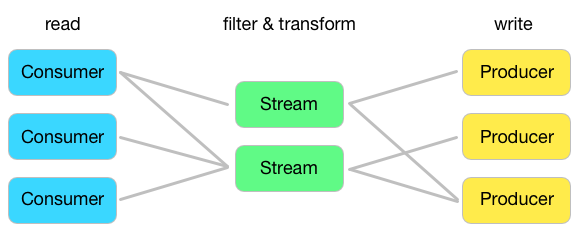

.. gollum documentation master file, created by
   sphinx-quickstart on Thu Mar  5 12:16:57 2015.
   You can adapt this file completely to your liking, but it should at least
   contain the root `toctree` directive.

Welcome to Gollum's documentation!
==================================

.. image:: gollum.png

What is Gollum?
---------------

Gollum originally started as a tool to **MUL**-tiplex **LOG**-files (read it backwards to get the name).
It quickly evolved to a one-way router for all kinds of messages, not limited to just logs.
Gollum is written in Go to make it scaleable and easy to extend without the need to use a scripting language.

Terminology
-----------

The main components of Gollum are consumers, streams and producers. To explain these it helps imagineing to look at Gollum "from the outside".

- A consumer "consumes" message, i.e. it reads data from some external service or e.g. listens to a port.
- A producer "produces" messages, i.e. it writes data to some external service or e.g. to disk.
- A stream defines a path between one or more consumers and one or more producers.
- A single set of data passing over a stream is called a message.

These main components, consumers, producers and streams are also called plugins and can be configured individually.
Every plugin has a different sets of options.
Streams for example can define filters that can inspect a message and decide wether to drop it or let it pass.
Producers and streams may use formatters to modify a message's content to e.g. store a plain-text log in a JSON backed storage.
Filters and Formatters are plugins, too, but can only be configured in context of another plugin like a stream.
As of this they are called "nested plugins". This plugins also have access to all configuration options of their "host" plugin.

Configuration
-------------

A Gollum configuration file is written in YAML and may contain any number of plugins.
Multiple plugins of the same type are possible, too.
The Gollum core does not make any assumption over the type of data you are processing.
Plugins however may do that. So it is up to the person configuring Gollum to ensure valid data is passed from consumers to producers.
Formatters can help to achieve this.

Running Gollum
--------------

Gollum goes into an infinte loop once started.
You can shutdown gollum by sending a SIG_INT, i.e. Ctrl+C.
Gollum has several commandline options that can be accessed by starting Gollum without any paramters:

**-c, --config=""**
   Use a given configuration file.
**-h, --help=false**
  Print this help message.
**-ll, --loglevel=0**
  Set the loglevel [0-3]. Higher levels produce more messages.
**-m, --metrics=0**
  Port to use for metric queries. Set 0 to disable.
**-n, --numcpu=0**
  Number of CPUs to use. Set 0 for all CPUs.
**-p, --pidfile=""**
  Write the process id into a given file.
**-pc, --profilecpu=""**
  Write CPU profiler results to a given file.
**-pm, --profilemem=""**
  Write heap profile results to a given file.
**ps, --profilespeed=false**
  Write msg/sec measurements to log.
**-tc, --testconfig=""**
  Test a given configuration file and exit.
**-v, --version=false**
  Print version information and quit.

Table of contents
-----------------

.. toctree::
   :maxdepth: 1

   consumers/index
   streams/index
   producers/index
   filters/index
   formatters/index
   examples/index
   license/index
